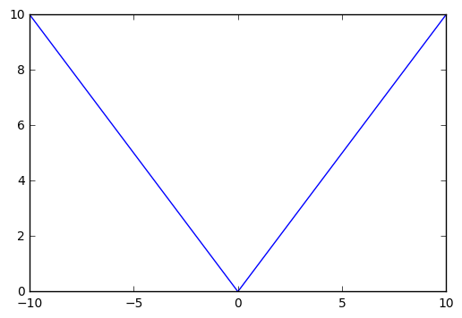

```python
%matplotlib inline
```


```python
from matplotlib import pyplot as plt
import numpy as np
```


```python
fig, ax = plt.subplots()
xs = np.arange(-10, 11, 1)
ys = np.abs(xs)
ax.plot(xs, ys);
        
```




